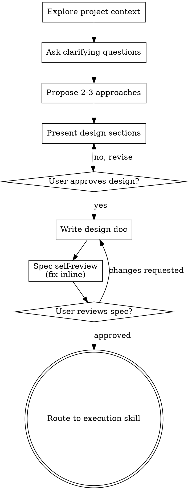

# Brainstorming Ideas Into Designs

Turn ideas into fully formed designs and specs through natural collaborative dialogue.

Start by understanding the current project context, then ask questions one at a time to refine the idea. Once you understand what you're building, present the design and get user approval.

<HARD-GATE>
Do NOT invoke any implementation skill, write any code, scaffold any project, or take any implementation action until you have presented a design and the user has approved it. This applies to EVERY project regardless of perceived simplicity.
</HARD-GATE>

## Anti-Pattern: "This Is Too Simple To Need A Design"

Every project goes through this process. A todo list, a single-function utility, a config change — all of them. "Simple" projects are where unexamined assumptions cause the most wasted work. The design can be short (a few sentences for truly simple projects), but you MUST present it and get approval.

## Checklist

You MUST create a task for each of these items and complete them in order:

1. **Explore project context** — check files, docs, recent commits
2. **Offer the visual companion just-in-time** — NOT upfront. The first time a question would genuinely be clearer shown than described, offer it then (its own message); on approval its browser tab opens for you. If no visual question ever arises, never offer it. See the Visual Companion section below.
3. **Ask clarifying questions** — one at a time, understand purpose/constraints/success criteria
4. **Propose 2-3 approaches** — with trade-offs and your recommendation
5. **Present design** — in sections scaled to their complexity, get user approval after each section
6. **Write design doc** — save to `docs/specs/YYYY-MM-DD-<topic>-design.md` and commit
7. **Spec self-review** — quick inline check for placeholders, contradictions, ambiguity, scope (see below)
8. **User reviews written spec** — ask user to review the spec file before proceeding
9. **Transition to implementation** — based on task context, recommend and route to `developer-plan-feature` (feature) or `saturn-jaygarcia` (general task) — see Transition section

## Process Flow



**The terminal state is routing to `developer-plan-feature` or `saturn-jaygarcia`.** Do NOT write code or scaffold before the user confirms the execution path.

## The Process

**Understanding the idea:**

- Check out the current project state first (files, docs, recent commits)
- Before asking detailed questions, assess scope: if the request describes multiple independent subsystems, flag this immediately. Help the user decompose into sub-projects with their own spec → plan → implementation cycle.
- For appropriately-scoped projects, ask questions one at a time to refine the idea
- Prefer multiple choice questions when possible
- Only one question per message — break topics into multiple questions if needed
- Focus on understanding: purpose, constraints, success criteria

**Exploring approaches:**

- Propose 2-3 different approaches with trade-offs
- Lead with your recommended option and explain why

**Presenting the design:**

- Once you understand what you're building, present the design
- Scale each section to its complexity: a few sentences if straightforward, up to 200-300 words if nuanced
- Ask after each section whether it looks right so far
- Cover: architecture, components, data flow, error handling, testing
- Be ready to go back and clarify if something doesn't make sense

**Design for isolation and clarity:**

- Break the system into smaller units that each have one clear purpose, communicate through well-defined interfaces, and can be understood and tested independently
- Can someone understand what a unit does without reading its internals? Can you change the internals without breaking consumers? If not, the boundaries need work.

**Working in existing codebases:**

- Explore the current structure before proposing changes. Follow existing patterns.
- Where existing code has problems that affect the work, include targeted improvements as part of the design.
- Don't propose unrelated refactoring. Stay focused on what serves the current goal.

## After the Design

**Documentation:**

- Write the validated design (spec) to `docs/specs/YYYY-MM-DD-<topic>-design.md`
  - (User preferences for spec location override this default)
- Commit the design document to git

**Spec Self-Review:**
After writing the spec document, look at it with fresh eyes:

1. **Placeholder scan:** Any "TBD", "TODO", incomplete sections, or vague requirements? Fix them.
2. **Internal consistency:** Do any sections contradict each other? Does the architecture match the feature descriptions?
3. **Scope check:** Is this focused enough for a single implementation plan, or does it need decomposition?
4. **Ambiguity check:** Could any requirement be interpreted two different ways? If so, pick one and make it explicit.

Fix any issues inline. No need to re-review — just fix and move on.

**User Review Gate:**
After the spec review loop passes, ask the user to review the written spec before proceeding:

> "Spec written and committed to `<path>`. Please review it and let me know if you want to make any changes before we start writing out the implementation plan."

Wait for the user's response. If they request changes, make them and re-run the spec review loop. Only proceed once the user approves.

**Transition to Implementation:**

Based on the full brainstorming context, assess the task type before presenting options:

- **Signals for `developer-plan-feature`**: new screen, new feature, domain entity, use case, repository, data layer, BLoC, StateHolder, API integration — anything that touches Clean Architecture layers
- **Signals for `saturn-jaygarcia`**: refactor, tooling, script, config, migration, CI/CD, infrastructure — non-layered changes

Place the recommended option first with `(Recommended)` in its label. Call `AskUserQuestion`:

```
question    : "Spec saved to <spec-path>. How would you like to implement this?"
header      : "Implementation"
multiSelect : false
options     :
  [recommended first, other second]
  - label: "Clean Architecture Feature (Recommended)",
    description: "Spawns layer-specialist agents (Domain → Data → Pres → App → UI). Pass the spec path — planners will read it as a reference doc."
  - label: "General Engineering Task (Recommended)",
    description: "lucci-planner reads the spec and explores the codebase, then kaku-worker executes the plan unattended."
```

**If Clean Architecture Feature chosen:**
> Tell the user: "Run `/developer-plan-feature <spec-path>` — the spec will be passed to all layer planners as a reference document."

**If General Engineering Task chosen:**
> Tell the user: "Run `/saturn-jaygarcia <spec-path>` — lucci-planner will read the spec before writing the plan."

## Key Principles

- **One question at a time** - Don't overwhelm with multiple questions
- **Multiple choice preferred** - Easier to answer than open-ended when possible
- **YAGNI ruthlessly** - Remove unnecessary features from all designs
- **Explore alternatives** - Always propose 2-3 approaches before settling
- **Incremental validation** - Present design, get approval before moving on
- **Be flexible** - Go back and clarify when something doesn't make sense

## Visual Companion

A browser-based companion for showing mockups, diagrams, and visual options during brainstorming. Available as a tool — not a mode.

**Offering the companion (just-in-time):** Do NOT offer it upfront. Wait until a question would genuinely be clearer shown than told — a real mockup / layout / diagram question, not merely a UI *topic*. The first time that happens, offer it then, as its own message:
> "This next part might be easier if I show you — I can put together mockups, diagrams, and comparisons in a browser tab as we go. It's still new and can be token-intensive. Want me to? I'll open it for you."

**This offer MUST be its own message.** Only the offer — no clarifying question, summary, or other content. Wait for the user's response. If they accept, start the server with `--open` so their browser opens to the first screen automatically. If they decline, continue text-only and don't offer again unless they raise it.

**Per-question decision:** Even after the user accepts, decide FOR EACH QUESTION whether to use the browser or the terminal. The test: **would the user understand this better by seeing it than reading it?**

- **Use the browser** for content that IS visual — mockups, wireframes, layout comparisons, architecture diagrams
- **Use the terminal** for content that is text — requirements questions, conceptual choices, tradeoff lists, scope decisions

If they agree to the companion, read the detailed guide before proceeding:

```bash
cat "$CLAUDE_PLUGIN_ROOT/skills/brainstorming/visual-companion.md"
```

It contains the full server API, HTML templates, CSS classes, event format, and design tips.

**Starting the server:**

```bash
"$CLAUDE_PLUGIN_ROOT/skills/brainstorming/scripts/start-server.sh" --project-dir /path/to/project --open
```

Save the `screen_dir` and `state_dir` from the JSON response. Share the complete URL (including `?key=…`) with the user.
